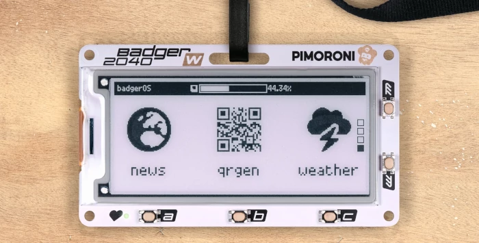
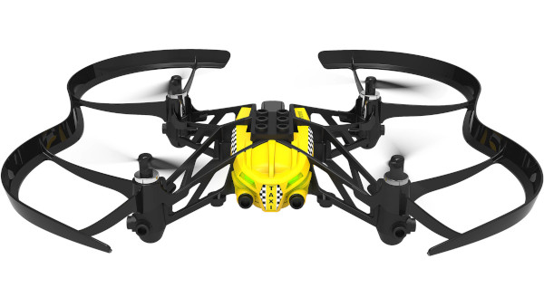
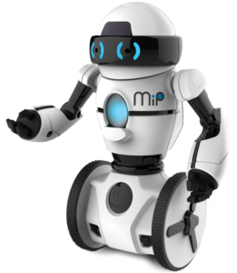

# Gophercon 2024

The is the repository for the hardware hack session at Gophercon 2024.

https://gophercon.com/

### If you received a GopherBadger2040, it is yours to keep. Please return all other equipment when you are finished for the next person. Thank you!

## Installation

Please read our [installation instructions here](./INSTALL.md).

## Activities

### Badger2040-W Hacking

If you are one of the very fortunate individuals to have received a Badger2040 badge tha tis programmable using TinyGo, it is in fact yours to keep!

Go to https://github.com/conejoninja/badger2040 for more info.

### Parrot Minidrones

We have Parrot Minidrones you can fly with Go code to control them using their built-in Bluetooth API.

Post in-flight videos using hashtag #gophercon

Ready for takeoff? Go to [./drone/minidrone/](./drone/minidrone/).

### Powerup Miniblimps

We have miniature blimps using modified Powerup programmable paper airplanes that you can fly with Go code to control them using their built-in Bluetooth API.

Post in-flight videos using hashtag #gophercon

Ready for takeoff? Go to [./drone/powerup/](./drone/powerup/).

### WowWee MiP robots

Along for the ride, we brought a couple of WowWee MiP two-wheeled self-balancing robots that you control using Bluetooth.

Post robot videos using hashtag #gophercon

Ready to roll? Go to [./robot/mip](./robot/mip/).

### WowWee CHiP robot dog

We also brought our WowWee CHiP the robot dog that you control using Bluetooth.

Post robot videos using hashtag #gophercon

Ready to ddo some new tricks? Go to [./robot/chip](./robot/chip/).

### TinyGo Open LED Race

Minimalist race game with an LED strip.

For more information, please go to https://github.com/conejoninja/ledrace

### TinyGo IoT sensors

Looking for the true "parts experience"? Got you covered! We have brought some Arduino Nano RP2040 Connect IoT microcontroller boards for each person to use for the activity.

https://store.arduino.cc/collections/boards/products/arduino-nano-rp2040-connect

These can be programmed using TinyGo.

There are some Grove sensor kits that you can use for the activity.

Ready to try this out? Go to [./sensor/arduino/](./sensor/arduino/) to get started.

### TinyGo Music Jam

Make your own electronic musical instruments using TinyGo and the Raspberry Pi Nano boards.

Thanks to the USB-MIDI support, you can turn your board into a tiny digital musical instrument controller.

Add buttons, sliders, a joystick, and when we say become part of the music we mean it!

Let's make beautiful music together, just go to [./musicjam/](./musicjam/).

### Sphero Ollie robots

Turns out we had a few unopened Sphero Ollie robots that we found just in time for Gophercon! These fast Bluetooth controlled robotic toys have long been a Go programmer fan favorite.

There are a few of these cylindrical robots to help satisfy your need for speed.

Want to take one for a spin? Go to [./robot/sphero/](./robot/sphero/).

## Bounties

We have some additional bounties and prizes, [you can see more information here](./BOUNTIES.md).

## License

Copyright (c) 2015-2023 The Hybrid Group and friends. Licensed under the MIT license.
